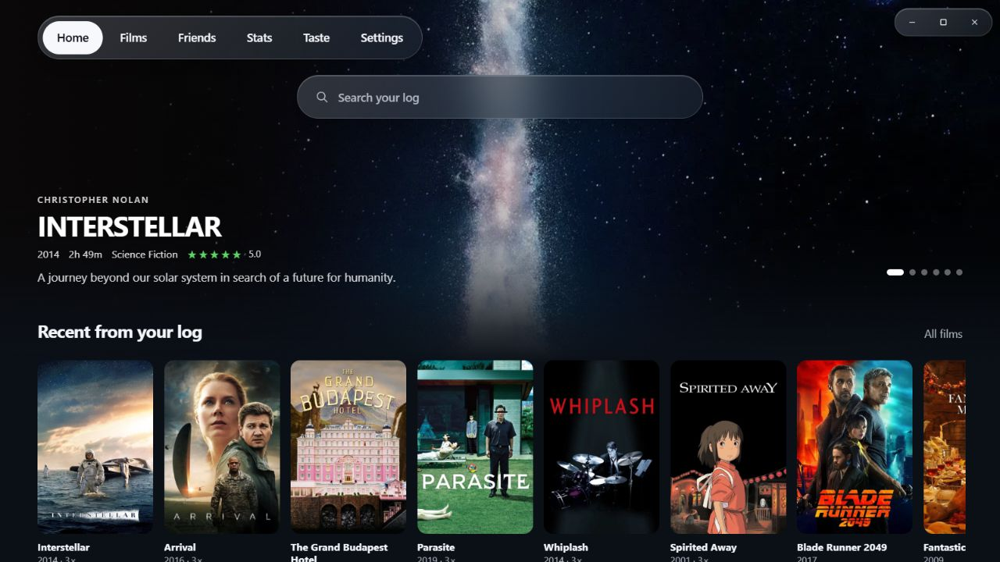
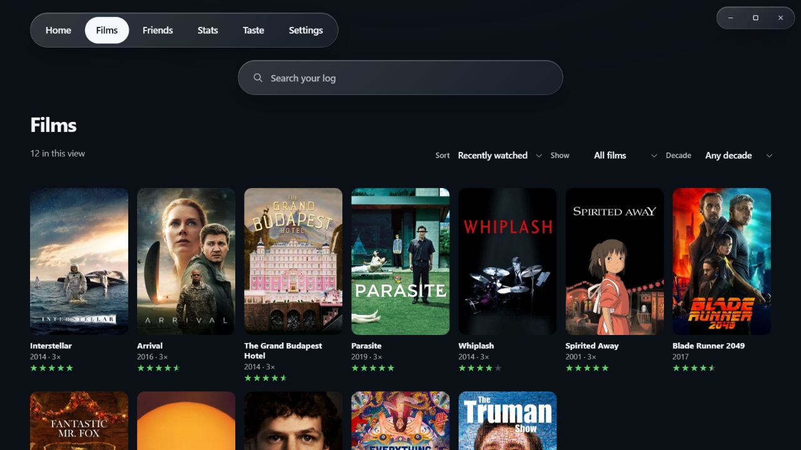
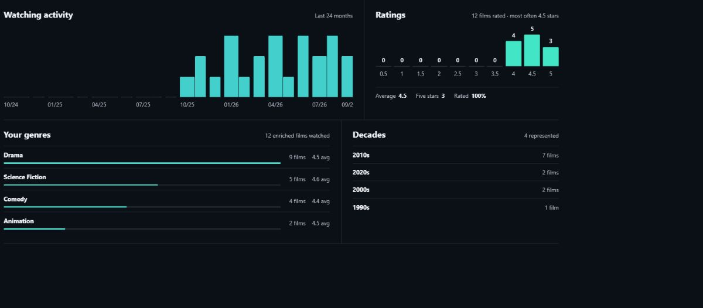
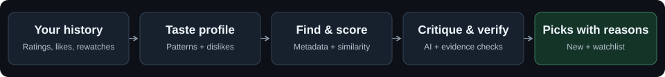

# Studio

### Your film life, beautifully in focus.

Rediscover what you love. Find what to watch next.

**A personal film library for Windows, built around your Letterboxd history.**

[**Download for Windows**](https://github.com/rjreny/studio/releases/latest) · [Getting started](#make-it-yours) · [How Taste works](#meet-taste) · [Report an issue](https://github.com/rjreny/studio/issues)

Studio's actual interface, rendered in a browser with a sample library. Ratings and viewing activity are illustrative.

Your diary is more than a list of films. It's the directors you keep returning to, the unexpected five-star discoveries, and the comfort watches you've lost count of. Studio brings that history together in a desktop app made for browsing—and turns it into a starting point for your next great watch.

## A home for your love of film

- **A library worth getting lost in.** Browse poster shelves, cinematic backdrops, and rich film pages with cast, crew, and your viewing history. Search your log, sort by rating, or filter by decade and watchlist.
- **Your Letterboxd life comes with you.** Import an official export ZIP for full history, then connect your public diary for ongoing RSS updates. Keep ratings, likes, and rewatches close at hand.
- **Find the patterns in your watching.** Explore activity over time, rating distributions, favorite genres, and your most rewatched films in Stats.
- **Keep up with your film people.** Add friends by Letterboxd username and browse their recent public ratings inside Studio.
- **Give your watchlist some direction.** Taste offers new discoveries alongside picks from films you've already saved, with evidence behind the connections.
- **Keep your library on your machine.** Studio stores its library in a local SQLite database. Online services add metadata, diary updates, and optional AI analysis.

<strong>Take a closer look at Films and Stats</strong>

### Every film, within reach

### Your watching habits, at a glance

These screenshots use the real interface with sample data. See [screenshot notes](docs/images/README.md).

## Meet Taste

**Recommendations with a reason to be there.**

Taste looks for connections across the films you've rated: the people who made them, the stories and genres they share, and how closely they resemble both your favorites and your disappointments. Your rating habits, likes, rewatches, and recent viewing help shape the picture.

**What makes this interesting:**

| Part of Taste | What it does for you |
| --- | --- |
| Your rating habits | Considers how a rating compares with your usual scores, while preserving explicit positive and negative signals. |
| Connections across film craft | Looks at directors, writers, cinematographers, composers, cast, genres, and keywords. |
| Semantic comparison | Uses numerical representations of film descriptions and metadata to compare candidates with films you liked **and** disliked. |
| Evidence checks | Checks candidate identity and eligibility, and grounds explanations in known film evidence. |
| Feedback with context | Lets you distinguish a bad connection from something you're simply not in the mood for. |

The recommendation code builds and validates the lists; AI helps critique the shortlist, research gaps when enabled, and describe your taste. Generated narration does not get to invent the final lineup.

### Where Taste is heading

The next iteration is in active development: separating **predicted enjoyment** from **confidence in the evidence**, finding candidates through broader semantic retrieval, and reducing repetitive picks when their fit is close. These changes are being evaluated and may not yet be in the downloadable release.

The aim is a more personal, better explained shortlist. Studio does not currently claim benchmark superiority over other recommendation services. [Read the technical overview →](docs/taste.md)

## Make it yours

1. **Install Studio.** Open the [latest release](https://github.com/rjreny/studio/releases/latest), download the Windows x64 `setup.exe`, and run it. Updates are available inside the app.
2. **Bring your history.** Import your Letterboxd export ZIP for the fullest picture, or connect your public diary by username to start with recent activity. RSS covers a recent window; it does not replace a full export.
3. **Bring the artwork.** Add your own TMDB API key in **Settings → Library** to match films and fetch posters and metadata.
4. **Explore Taste.** With at least **8 rated films**, add your own OpenRouter key in **Settings → Taste** and run an analysis. More history gives the system more evidence to work with.

**Before you start:** Studio currently ships for Windows x64. Taste uses your OpenRouter account; model, embedding, and optional web-search requests may incur provider charges. During analysis, film-history evidence and metadata are sent through OpenRouter to the selected services. Your library is stored locally, but online features require a connection and are not entirely on-device.

## Built with care, open to explore

Studio uses **Tauri 2, Rust, React, TypeScript, and SQLite**. To run it from source, see the [developer README](studio/README.md). For the desktop host decision, see [why Tauri](docs/runtime-decision.md).

Found a rough edge or have an idea? [Open an issue](https://github.com/rjreny/studio/issues). For a recommendation that misses, include what felt wrong about the connection—it's useful feedback for the next iteration.

Film metadata and artwork are provided by TMDB. This product uses the TMDB API but is not endorsed or certified by TMDB. Studio is an independent project and is not affiliated with Letterboxd.
